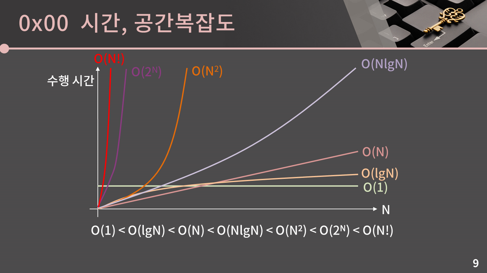
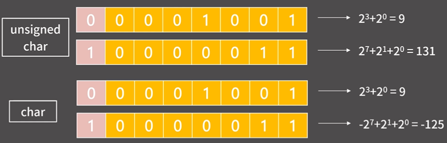
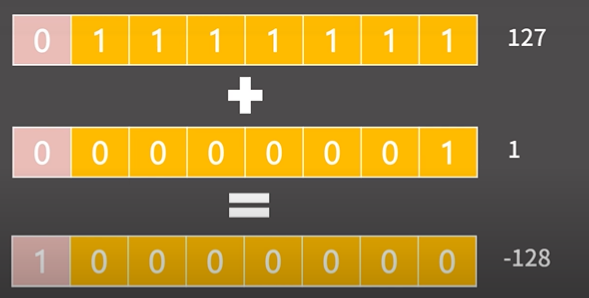

### 0x01강 - 기초 코드 작성 요령 I

#### 0x00. 시간, 공간복잡도
* **시간복잡도**
    * 입력의 크기와 문제를 해결하는데 걸리는 시간의 상관관계
* **빅오표기법**
    * 주어진 식을 값이 가장 큰 대표항만 남겨서 나타내는 방법
    

* 문제에서 주어지는 시간이 1~5초일 때
  * 알고리즘의 시간 복잡도를 확인해야됨!(시간초과 방지)

|N의 크기|허용 시간복잡도|
|------|---|
|N ≤ 11|O(N!)|
|N ≤ 25|O(22)
|N ≤ 100|O(N4)|
|N ≤ 500|O(N3)|
|N ≤ 3,000|O(N2lgN)|
|N ≤ 5,000|O(N2)|
|N ≤ 1,000,000|O(NlgN)|
|N ≤ 10,000,000|O(N)|
|그 이상|O(lgN), o(1)|

* **공간복잡도**
  * 입력의 크기와 문제를 해결하는데 필요한 공간의 상관관계
  * 공간복잡도보다는 시간복잡도가 중요!
  * 512MB = 1.2억개의 int라는 것을 기억!
  
  
#### 0x01. 정수 자료형
* char 자료형은 1byte = 8bit 이다.
  * 8개의 칸에 0 혹은 1의 값(2진수)이 들어간다.
  
  * unsigned와 signed가 있다는 것을 기억하자.
  

* Integer Overflow

  * Integer Overflow를 막는 방법
    * 값을 가지게끔 연산을 수행하면 됨
  
#### 0x02. 실수 자료형(IEEE-754 format)
1. 실수의 저장/연산 과정에서 반드시 오차가 발생할 수 밖에 없다.
  * fraction field를 가지고 자료형이 어디까지 유효한지 확인
  * `float`: 유효숫자 6자리
  * `double`: 유효숫자 15자리
2. double에 long long 범위의 정수를 함부로 담으면 안된다.
3. 실수를 비교할 때는 등호를 사용하면 안됨
